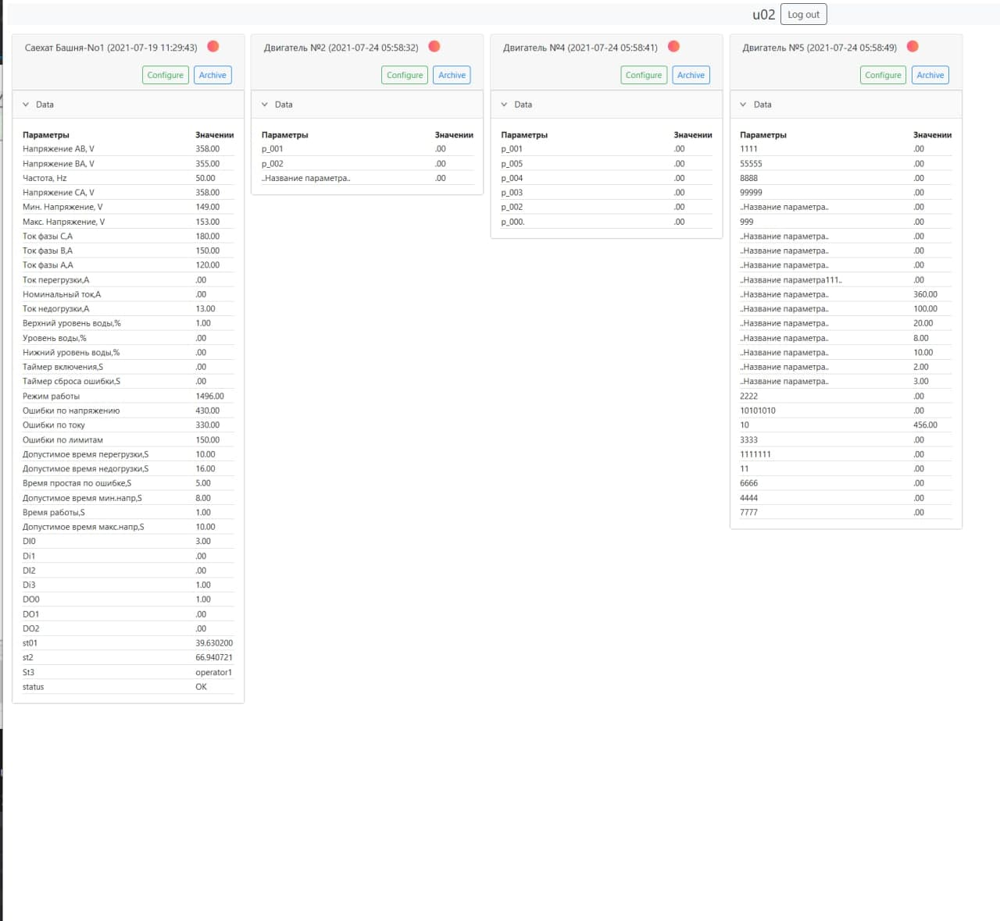
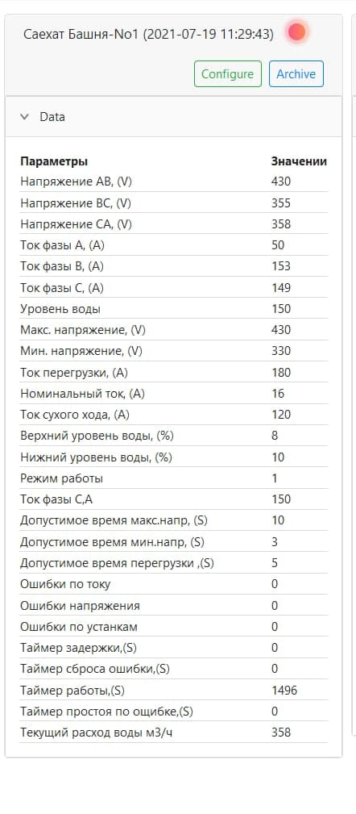
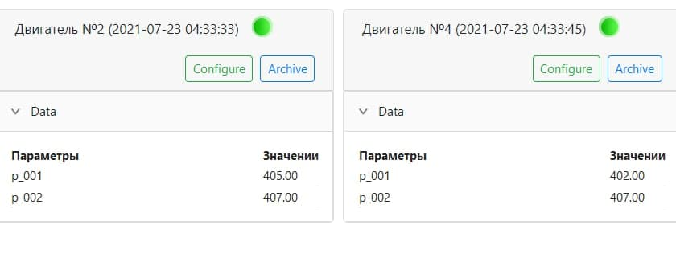
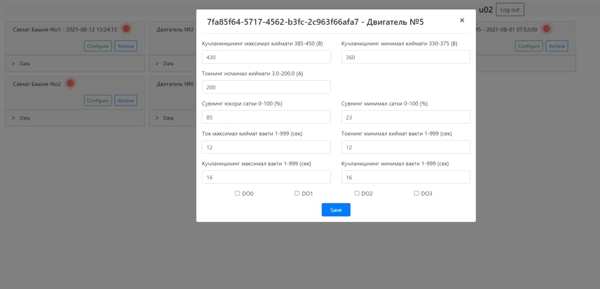
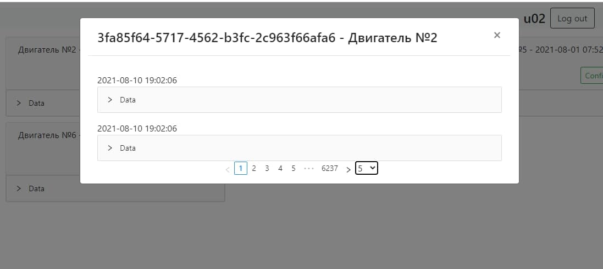
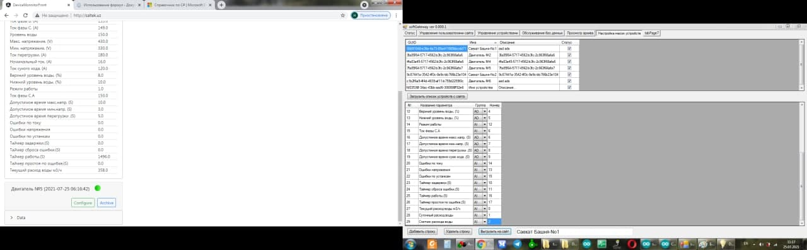

# DeviceMonnitorConsole

This project developed purpose of controlling water and oil pumps remotely in shortly said webscada system.

Project developed using .Net core 5, Angular 12 and MySQL.

## Web view
Developed system saves parameters dynamically operators can integrate it to any system.

Full screen view of project:



Parameter of pump and fluid levels red dot upper right of card means device is not active:



Cards with another paramaters:



Configuration modal screen to limit vorkload of electric engines: 



archive data modal view, log system:



## WinForms for ```administrators``` to control users and devices:

on the right side control system for operator access, devices and its parameters:




